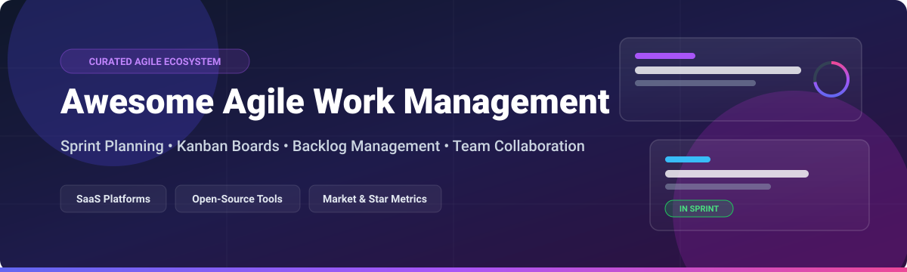

# Awesome Agile Work Management 🚀

  

  
  
  
  

> **Curated List of SaaS Products & Open-Source GitHub Projects** 🎯  
> *Focused on Sprint Planning, Kanban Boards, Backlog Management, Issue Tracking & Team Collaboration*  
>  
> 📅 **Last updated:** October 2026

---

## 📌 Table of Contents

- [💡 Overview](#-overview)
- [🏢 SaaS & Hosted Platforms](#-saas--hosted-platforms)
- [🔓 Open-Source GitHub Projects](#-open-source-github-projects)
  - [🚀 Full-Featured Agile Platforms](#-full-featured-agile-platforms)
  - [⚡ Lightweight & Focused Tools](#-lightweight--focused-tools)
  - [🐛 Issue Trackers & Bug Management](#-issue-trackers--bug-management)
- [🤝 How to Contribute](#-how-to-contribute)
- [💖 Support & Sponsorship](#-support--sponsorship)
- [📈 Star History](#-star-history)
- [⚖️ Disclaimer](#%EF%B8%8F-disclaimer)

---

## 💡 Overview

This repository tracks top-tier **SaaS platforms** and **open-source projects** for **Agile Work Management**. These tools help software development teams, product managers, and Agile coaches plan sprints, manage product backlogs, track issues, and deliver software iteratively.

---

## 🏢 SaaS & Hosted Platforms

> [!NOTE]  
> **Market Size & Structure:** The global Agile work management software market is estimated at **~$6.5 Billion (2026)** and is growing at ~13.5% CAGR. The sector is **moderately concentrated** at the top by enterprise suites like Atlassian Jira and Microsoft Azure Boards (winner-take-most for enterprise contracts), but remains **fragmented** in the mid-market and startup segments where modern, high-speed tools (Linear, ClickUp, Monday) capture significant market share.

Below is a curated comparison of leading SaaS Agile work management platforms, sorted by **Company Size / Valuation (Descending)**:

| Platform 🛠️ | Company Size / Revenue / Valuation 💰 | Starting Paid Tier Pricing 💵 | Free Tier / Free Trial Limits 🎁 | Key Features & Focus ⚡ |
| :--- | :--- | :--- | :--- | :--- |
| **[Azure Boards](https://azure.microsoft.com/en-us/products/devops/boards/)** | **~$245 Billion** (Microsoft Cloud Revenue) | **$6/user/month** (Azure DevOps Plan) | **Free forever for up to 5 users** (Unlimited private repos & boards) | Deep Azure DevOps integration, work items, Kanban boards, sprint backlogs, and enterprise dashboards. |
| **[Jira Software](https://www.atlassian.com/software/jira)** | **~$4.2 Billion** Revenue / **~$40 Billion** Market Cap | **$8.15/user/month** (Standard Plan) | **Free forever for up to 10 users** (2 GB storage, community support) | Dominant enterprise Agile platform; Scrum/Kanban boards, roadmaps, and 3,000+ Atlassian Marketplace apps. |
| **[Asana](https://asana.com/)** | **~$650 Million** Annual Revenue | **$10.99/user/month** (Starter Plan) | **Free forever for up to 10 users** (Unlimited tasks, projects, messages & activity logs) | Work management with Agile views, timelines, portfolios, goals, and cross-functional team collaboration. |
| **[Monday Dev](https://monday.com/)** | **~$840 Million** Revenue / **~$13 Billion** Market Cap | **$12/user/month** (Basic Dev Plan, min 3 seats) | **14-day free trial** (Unlimited seats/features) / Free individual tier up to 2 seats | Agile work management within monday work OS; sprint planning, visual Kanban, and automated workflows. |
| **[ClickUp](https://clickup.com/)** | **~$4.0 Billion** Valuation (Private) | **$7/user/month** (Unlimited Plan) | **Free forever plan** (100 MB storage, 100 views/uses of feature limits) | All-in-one productivity suite; sprint points, Kanban, Gantt charts, docs, whiteboards, and custom goals. |
| **[Wrike](https://www.wrike.com/)** | **~$2.5 Billion** Acquisition / Valuation | **$9.80/user/month** (Team Plan) | **Free forever for up to 5 users** (Task management, 2 GB storage limit) | Enterprise-grade collaborative work management; custom Agile workflows, backlogs, and interactive Gantt charts. |
| **[Linear](https://linear.app/)** | **~$1.25 Billion** Valuation (Private) | **$8/user/month** (Standard Plan) | **Free forever plan** (Unlimited members, up to 250 active issues) | Ultra-fast, keyboard-first issue tracker; cycles, project modules, auto-linking GitHub PRs, and high-craft UX. |
| **[Productboard](https://www.productboard.com/)** | **~$1.7 Billion** Valuation (Private) | **$20/user/month** (Essentials Plan) | **14-day free trial** (Full feature access, no credit card required) | Customer feedback aggregation, feature prioritization matrix, and high-level product roadmaps synced to Jira. |
| **[Shortcut](https://shortcut.com/)** | **~$100 Million+** Valuation (Private) | **$8.50/user/month** (Business Plan) | **Free forever for up to 10 users** (Unlimited stories, epics, and docs) | Purpose-built Agile project management for engineering; stories, epics, iterations, and lightweight Kanban. |
| **[Targetprocess](https://www.targetprocess.com/)** | **~$80 Million** Estimated Revenue (Apptio / IBM) | **$20/user/month** (Enterprise Tier) | **30-day free trial** (Full enterprise SAFe suite access) | Enterprise SAFe (Scaled Agile Framework), LeSS, and custom Agile framework execution with advanced portfolio analytics. |

---

## 🔓 Open-Source GitHub Projects

The open-source Agile ecosystem is production-proven and mature, providing strong options for self-hosting and full data sovereignty. Sorted below by **GitHub Star Count (Descending)**:

### 🚀 Full-Featured Agile Platforms

- **[Plane](https://github.com/makeplane/plane)**   
  **Modern Linear alternative built for speed.** **AGPL-3.0 licensed**  
  *Key Features:* Issues, Cycles (sprints), Modules (epics), Pages (docs), Analytics, real-time collaboration, and GitHub/Slack integrations. Docker Compose ready.

- **[Focalboard](https://github.com/mattermost/focalboard)**   
  **Self-hosted Notion & Trello alternative.** **MIT/AGPL licensed**  
  *Key Features:* Kanban boards, table & calendar views, multi-board filtering. *(Note: Community-maintained).*

- **[OpenProject](https://github.com/opf/openproject)**   
  **Most comprehensive open-source enterprise project platform.** **GPL-3.0 licensed**  
  *Key Features:* Scrum/Kanban boards, sprint backlogs, Gantt timelines, cost tracking, roadmap planning, and bug tracking with Docker/Helm support.

- **[Taiga](https://github.com/kaleidos-ventures/taiga-back)**   
  **Dedicated Agile platform for Scrum & Kanban teams.** **AGPL-3.0 licensed**  
  *Key Features:* Backlog grooming, sprint tracking, issue management, user stories, epics, and wiki integration.

---

### ⚡ Lightweight & Focused Tools

- **[Wekan](https://github.com/wekan/wekan)**   
  **Popular open-source Trello-like Kanban board.** **MIT licensed**  
  *Key Features:* Drag-and-drop cards, swimlanes, checklists, real-time notifications, REST API, and Meteor framework.

- **[Vikunja](https://github.com/go-vikunja/vikunja)**   
  **Feature-rich task management app.** **AGPL-3.0 licensed**  
  *Key Features:* Gantt charts, Kanban boards, task lists, relations, CalDAV sync, labels, and team sharing.

- **[Kanboard](https://github.com/kanboard/kanboard)**   
  **Minimalist, zero-bloat self-hosted Kanban board.** **MIT licensed**  
  *Key Features:* Simple drag-and-drop, swimlanes, subtasks, task analytics, LDAP auth, and SQLite/PostgreSQL support.

- **[Super Productivity](https://github.com/johannesjo/super-productivity)**   
  **Advanced To-Do List & Time Tracker with Jira/GitLab integration.** **MIT licensed**  
  *Key Features:* Time tracking, task scheduling, Pomodoro timer, and direct integrations with Jira, GitHub, and OpenProject.

- **[Planka](https://github.com/plankanban/planka)**   
  **Elegant open-source real-time Kanban board for workgroups.** **MIT licensed**  
  *Key Features:* React/Redux based board, attachments, card labels, project member roles, and real-time updates.

- **[Tududi](https://github.com/chrisvel/tududi)**   
  **Hierarchical task manager for GTD and sprint planning.** **MIT licensed**  
  *Key Features:* Area → Project → Task hierarchy, Kanban board, due dates, CalDAV sync, and AI assistant integration.

---

### 🐛 Issue Trackers & Bug Management

- **[Redmine](https://github.com/redmine/redmine)**   
  **Extensible Ruby-based issue tracker & project manager.** **GPL-2.0 licensed**  
  *Key Features:* Multi-project support, Gantt chart, calendar, issue tracking, time logging, and 500+ community plugins.

- **[Leantime](https://github.com/Leantime/leantime)**   
  **Agile project management system for innovators & non-PMs.** **AGPL-3.0 licensed**  
  *Key Features:* Goal tracking, idea boards, sprint planning, Kanban boards, Gantt charts, and retrospectives.

- **[Bugzilla](https://github.com/bugzilla/bugzilla)**   
  **Battle-tested enterprise bug tracking system.** **MPL-2.0 licensed**  
  *Key Features:* Advanced search queries, scheduled reports, security bug flags, and email workflow notifications.

- **[Trac](https://github.com/edgewall/trac)**   
  **Enhanced wiki and issue tracking system for software projects.** **BSD licensed**  
  *Key Features:* Seamless Git/SVN integration, milestone roadmaps, ticket system, and plugin architecture.

---

## 🤝 How to Contribute

Contributions are warmly welcomed! 🌟 To contribute:

1. **Fork** this repository.
2. Create a feature branch (`git checkout -b add-new-tool`).
3. Add or update entries in `README.md` keeping formatting consistent.
4. Submit a **Pull Request** with a brief summary of the added tool.

---

## 💖 Support & Sponsorship

If this curated list saved you time or helped you choose an Agile tool for your team, please consider giving this repository a ⭐ **Star**, sharing it with your network, or supporting ongoing maintenance!

- ☕ **Sponsor / Buy me a coffee:** [GitHub Sponsors Dashboard](https://github.com/sponsors/ishandutta2007)
- 📢 **Share:** Tweet or post about this list on LinkedIn/Twitter!

---

## 📈 Star History

---

## ⚖️ Disclaimer

- This list is **community-curated** for educational and reference purposes.
- Trademarks and logos belong to their respective owners.
- Check compliance and security policies of individual platforms before handling sensitive project data.
